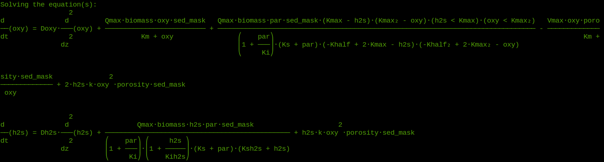

Concepts
==========

The concept behind :mod:`microbenthos`  models is to generate partial
differential equations of various analytes/variables that constitute the
relationships between the entities of the model. So the starting point for
creating microbenthic models is to write down the constitutive relationships
between chemical or metabolic processes and their dependencies on environmental
conditions.

The special case of microbenthic systems emerges from the extremely steep
gradients of most environmental parameters within a few millimeters, i.e.
irradiance intensity, oxygen, sulfide, biomass, etc. Microbial mats constitute
very dense, laminated populations of different microbial groups that occupy the
niches created by the microenvironments and exploit them through adapted and
specific metabolic processes.

Microbial mats are typically modelled as diffusive-reactive systems, i.e. the
dominant mode of mass transport is physical diffusion of solutes. This diffusion
occurs within the porespaces of the sediment matrix, which are considered to be
occupied by microbial populations. The "reactive" aspect refers to the presence
of a large number of "local" sources and sinks within the mat system. Indeed, a
vast array of metabolic pathways can be found within a few millimeters of
microbial mats, with one population thriving off the side-products of another
populations main process. Furthermore, the various metabolisms have responses to
multiple environmental parameters, responding to some with inhibition, to others
with saturation and preferences for an optimum level. This could be with respect
to light, or temperature, or oxygen or any other environmental parameters.

MicroBenthos recognizes that while the process of physical diffusion is simple
to model, the larger challenge is to have a flexible way to experiment with *in
silico* microbial mats, that can exhibit various types of metabolic responses.
So MicroBenthos helps in converting constitutive relationships for metabolic
processes, e.g. oxygenic photosynthesis is inhibited by oxygen and sulfide and
has an optimal light level, into mathematical equations and compiling several of
these into highly non-linear, coupled, partial differential equations. This is
done through symbolic computation (using :mod:`sympy`) and abstractions at the
level useful for microbial mats (sediment, diffusive boundary layer, microbial
biomass, etc) and then iteratively solving the differential equations (using
:mod:`fipy`) as the model clock evolves.

The :ref:`tutorials` provide a hands-on path towards creating and studying your
own *in silico* microbial mats which can include features such as:

* solar irradiance
* photopigment absorption
* microbial metabolisms (respiration, photosynthesis, etc)
* abiotic (geo)chemical processess
* biomass synthesis and growth
* ... and more to come

References
===========

* Rutger de Wit, Frank P. van den Ende, Hans van Gemerden; Mathematical
  simulation of the interactions among cyanobacteria, purple sulfur bacteria and
  chemotrophic sulfur bacteria in microbial mat communities, FEMS Microbiology
  Ecology, Volume 17, Issue 2, 1 June 1995, Pages 117–135 (`DOI <https://doi
  org/10.1111/j.1574-6941.1995.tb00136.x>`_)

* Hans van Gemerden; Microbial mats: A joint venture, Marine Geology, Volume
  113, Issues 1-2, July 1993, Pages 3-25 (`DOI <https://doi.org/10
  .1016/0025-3227(93)90146-M>`_)

* J. E. Guyer, D. Wheeler & J. A. Warren, FiPy: Partial Differential Equations
  with Python, Computing in Science & Engineering 11 (3) pp. 6-15 (2009), (`DOI
  <https://doi.org/10.1109/MCSE 2009.52>`_)
