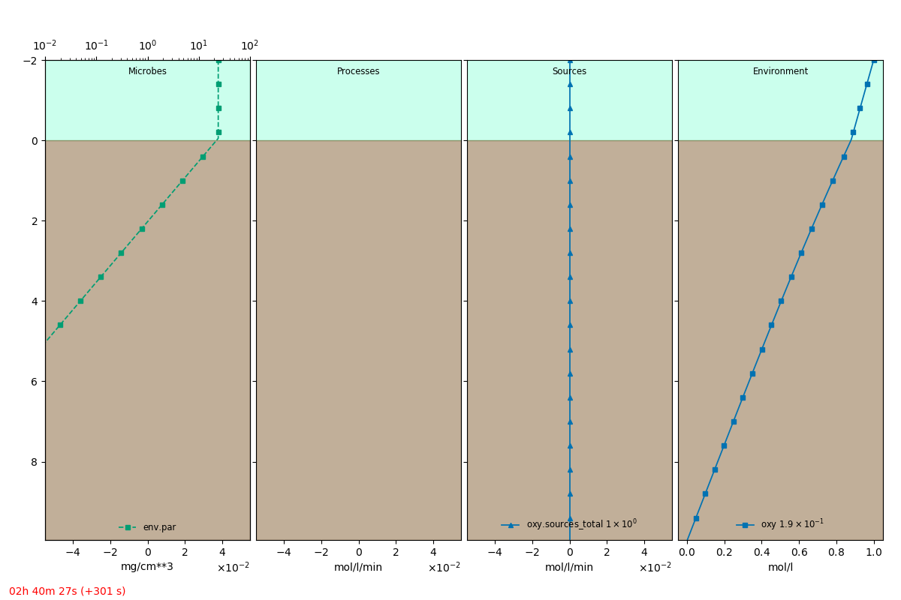

.. _tut01:

Defining a model
=================

Model definitions are specified in a YAML format file, here called ``definition_input.yml``. This
file is parsed and validated by :class:`~microbenthos.utils.loader.MicroBenthosSchemaValidator`.
Upon running with :ref:`cmd_simulate`, the validated definition file is written out to
``definition.yml``.

See the :download:`definition file <definition_input.yml>` for this tutorial.

Domain
-------
Here we go through the basic steps to define a model. First we have to define a model domain for
a microbial mat or sedimentary system. This is a diffusive system, i.e. the mass transport of
chemical solutes is primarily through physical diffusion. We define the model under the ``model``
key, and specify the domain properties.

.. literalinclude:: definition_input.yml
    :language: yaml
    :lineno-match:
    :start-after: # start: model
    :end-before: # start: environment
    :emphasize-lines: 6-10

This specifies that the domain should be a :class:`~microbenthos.core.domain.SedimentDBLDomain`,
with each cell of size 50 micrometers. We specify that the sediment sub-domain is 10 mm long, and
has a 2 mm thick diffusive boundary layer (DBL) on top of it. Additionally, we specify that the
`porosity`_ of the sediment domain is 0.6.

.. _porosity: https://en.wikipedia.org/wiki/Porosity

Environment
------------

The model ``environment`` is a container for various entities that live and interact within the
domain. The environment can contain specifications of

* :class:`~microbenthos.core.irradiance.Irradiance`
* :class:`~microbenthos.core.variable.ModelVariable`
* :class:`~microbenthos.core.process.Process`

We can specify a solar irradiance within the ``environment`` with

.. literalinclude:: definition_input.yml
    :language: yaml
    :lineno-match:
    :start-after: # start: environment
    :end-before: # start: oxygen model variable
    :emphasize-lines: 6-7, 10-11

This will render an irradiance source with a diel period (or daylength) of 4 hours with 50% of
the duration being illuminated. Essentially the irradiance source varies in a cosinusoidal
fashion (to approximate solar irradiance) with the specified period. This intensity is at the
surface. However, light propogates variably through a scattering medium like sediments. We can
specify one or more irradiance channels. We specify here that the photosynthetically active
radiation ``par``, usually means 400--700 nm, propagates in the sediment with an exponential
attenuation coefficient of 15.3 per centimeter. As the model clock is incremented, the value of
the surface irradiance varies with a zenith (noon time) value of 100 and dark value of 0. This
"incident" irradiance propagates through the domain according to the channels specified.

Variables
-----------

Suppose we want to construct a model where one of the variables we are solving for is the
distribution of oxygen. In the ``environment`` we define the variable

.. literalinclude:: definition_input.yml
    :language: yaml
    :lineno-match:
    :start-after: # start: oxygen model variable
    :end-before: # stop: oxygen model variable
    :emphasize-lines: 5-7,9-11,13-14

With this block, we have specified a :class:`~microbenthos.core.entity.ModelVariable` called
``oxy``. The ``hasOld: true`` is necessary to retain the values of the previous time-step during
the simulation evolution. The value is set to ``0.0 mol/m**3`` here (See `using units`_). For
numerical approximation of the model equations, we have to specify the boundary conditions for
the variables we want to solve for. We specify with ``constraints`` here the values at the top
and bottom of the model domains. Optionally, we can specify to seed the initial values of the
variable with a ``linear`` profile. Without ``start`` and ``stop`` conditions given, it will use
the values from the ``top`` and ``bottom`` constraints. This is only to set the value initially,
i.e. when the model clock is 0. The ``name`` entry can be any sympy compatible string, and is
used in string representations of the equation. But the actual key ``oxy`` is used in references
of the model path.

.. _using units:
.. note::
    Due to current limitations of the solving library :mod:`fipy`, the mesh of the
    domain is created in base SI units (meters), and so it is required for now to specify the
    variable's spatial units in meters. MicroBenthos attemps to cast the units to the domain mesh
    units internally, but it is better to specify it in the variable creation. All other
    parameters can be specified in other SI units and will be converted to the correct units
    internally.

Processes
----------

We have only specified a numerical placeholder for the oxygen variable as ``oxy``. In order for
it to behave as a chemical solute diffusing through the model domain, we have to specify the
process that will enable this.

.. literalinclude:: definition_input.yml
    :language: yaml
    :lineno-match:
    :start-after: # stop: oxygen model variable
    :end-before: # stop: oxy diffusion
    :emphasize-lines: 5, 7-8

Process definitions allow you to write a formula simply as a string, to represent a symbolic
expression that relates various domain variables and parameters. Here we specify the diffusion
coefficient of oxygen ``D_oxy`` which is the porosity multiplied by the free diffussion
coefficient ``D0_oxy``. The porosity is 0.6 in the sediment but 1.0 in the DBL, and this
variation will be reflected in the effective diffusion coefficient for ``oxy`` at each cell in
the model domain. This is a simple example, but much more complicated dependencies and variations
can be specified symbolically.

Equations
----------

Finally, we need to construct the actual equations we will want to solve. In this simplistic
example, we have only defined one variable which should exhibit diffusive transport in the domain
. So there will be only one equation for oxygen with only a diffusive and a transient term, as we
have not included any other sources or responses to irradiance. That will come in subsequent
tutorials, but let's proceed to build the single equation here.

.. literalinclude:: definition_input.yml
    :language: yaml
    :lineno-match:
    :start-after: # start: equations
    :end-before: # stop: equations
    :emphasize-lines: 3, 5

We specify an equation named ``oxyEqn`` which contains a transient term, pointing to the variable
we want to solve for ``domain.oxy`` (this could also be ``env.oxy``), and specify a diffusive
term that takes ``env.D_oxy`` as its diffusion coefficient. The second terms is a
multiplicative coefficient for each term in the final equation, here set to 1.

Run it
-------

This creates the equation to solve

.. math::

    \frac{d}{d t} oxy = Doxy \frac{d^{2}}{d z^{2}} oxy

Running the model simulation with::

    microbenthos -v simulate definition_input.yml --plot --show-eqns

should show the equation in the console and open up a graphical view of the model as it is
simulated.

An extracted frame is shown below.

Simulation run
---------------

Additionally, we can specify the parameters for the simulation evolution under the main
``simulation``
key.

.. literalinclude:: definition_input.yml
    :language: yaml
    :lineno-match:
    :start-after: # start: simulation
    :end-before: # stop: simulation

We specify with ``simtime_total`` that the total time for the simulation run is 8 hours.
Alternatively, one can set ``simtime_days`` to a number which will set the ``simtime_total`` as the
multiplication of the number with the ``hours_total`` of the irradiance source. MicroBenthos
performs adaptive time stepping of the simulation, i.e. increasing the simulation time steps to
larger values when possible and reducing it to smaller time-steps when the equations undergo a lot
of change. The range of the time-steps, usually dependent on the problem being solved, can be set
through ``simtime_lims``, in seconds.

The full :download:`definition file <definition_input.yml>` is:

.. literalinclude:: definition_input.yml
    :language: yaml
