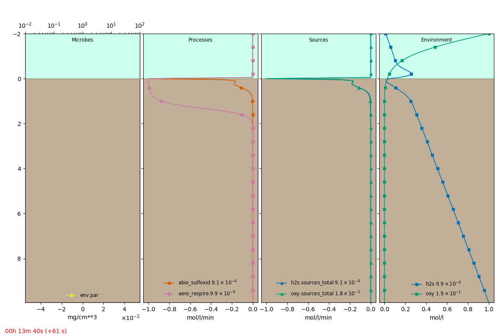

.. _tut02:

Chemical reactions
===================

In the previous tutorial :ref:`tut01`, we defined a microbenthic domain and a single variable to
construct a single differential equation. We will now create chemical reactions between two
solutes and study the dynamics and distributions of their variables by solving couple partial
differential equations.

See the :download:`definition file <definition_input.yml>` for this tutorial.

Firstly, we define another diffusive solute hydrogen sulfide :math:`H_2S` under ``environment``.

.. literalinclude:: definition_input.yml
    :language: yaml
    :lineno-match:
    :start-after: # start: h2s
    :end-before: # stop: h2s

Respiration
------------

We will now specify reactions that involve the ``oxy`` and ``h2s`` variables, which will be cast
as "source" terms in the differential equations. First we specify that the oxygen within the
sediment is consumed through aerobic respiration in the ``environment``.

.. literalinclude:: definition_input.yml
    :language: yaml
    :lineno-match:
    :start-after: # start: aero_respire
    :end-before: # stop: aero_respire
    :emphasize-lines: 4-8

This specification states that the respiration process at a rate of ``Vmax``. Since respiration
does not occur within the sediment grains but within the porespaces, we multiply it by
``porosity``, which is defined from the model domain. We want that the reaction occurs only in
the sediment and not in the water column, so we use the variable ``sed_mask``. This
merely selects the region of the domain that is the sediment. Additionally, we specify that the
rate of respiration has a saturation dependence on oxygen, that is the rate of the process slows
down at high enough levels (parameterized by ``Km``) of oxygen. What is the formulation for the
``saturation(oxy, Km)`` function? It can be specified under the ``namespace`` key of the process'
``init_params``. Alternatively, if a formula is to be reused then in a ``formulae``
section of the ``model`` as follows.

.. literalinclude:: definition_input.yml
    :language: yaml
    :lineno-match:
    :start-after: # start: formulae
    :end-before: # stop: formulae

Abiotic sulfide oxidation
--------------------------

Another process that occurs in sedimentary system is the abiotic oxidation of sulfide. That is
oxygen reacts with hydrogen sulfide in a 2:1 stoichiometry. We can define this process also in
the ``environment``.

.. literalinclude:: definition_input.yml
    :language: yaml
    :lineno-match:
    :start-after: # start: abio_sulfoxid
    :end-before: # stop: abio_sulfoxid
    :emphasize-lines: 4-7

This reaction process therefore couples the equations of the two variables ``oxy`` and ``h2s``,
that so far had no shared process terms. The definition of this process should therefore appear
in both equations.

The equations for this model will therefore be:

.. literalinclude:: definition_input.yml
    :language: yaml
    :lineno-match:
    :start-after: # start: equations
    :end-before: # stop: equations
    :emphasize-lines: 3-12, 14-21

Note that the stoichiometry of the sulfide oxidation process is represented by a coefficient of 2
in the oxygen equation, indicating that for each H2S consumed two O2 are consumed by this
process. The definition of the environmental process ``abio_sulfoxid`` enables us to easily
represent the process in multiple equations.

Run it
-------

This creates the equation to solve

.. math::

    \frac{d}{dt} oxy = Doxy \frac{d^{2}}{d z^{2}}  oxy - \frac{Vmax \cdot oxy \cdot porosity
    \cdot sed\_mask} {Km + oxy} + \\
    2 \cdot h2s \cdot k \cdot oxy^{2} \cdot porosity \cdot sed\_mask

    \frac{d}{dt} h2s = Dh2s \frac{d^{2}}{d z^{2}}  h2s + h2s \cdot k \cdot oxy^{2} \cdot porosity
    \cdot sed\_mask

Running the model simulation with::

    microbenthos -v simulate definition_input.yml --plot --show-eqns

should show the equation in the console and open up a graphical view of the model as it is
simulated.

An extracted frame is shown below.

The full :download:`definition file <definition_input.yml>` is:

.. literalinclude:: definition_input.yml
   :language: yaml
