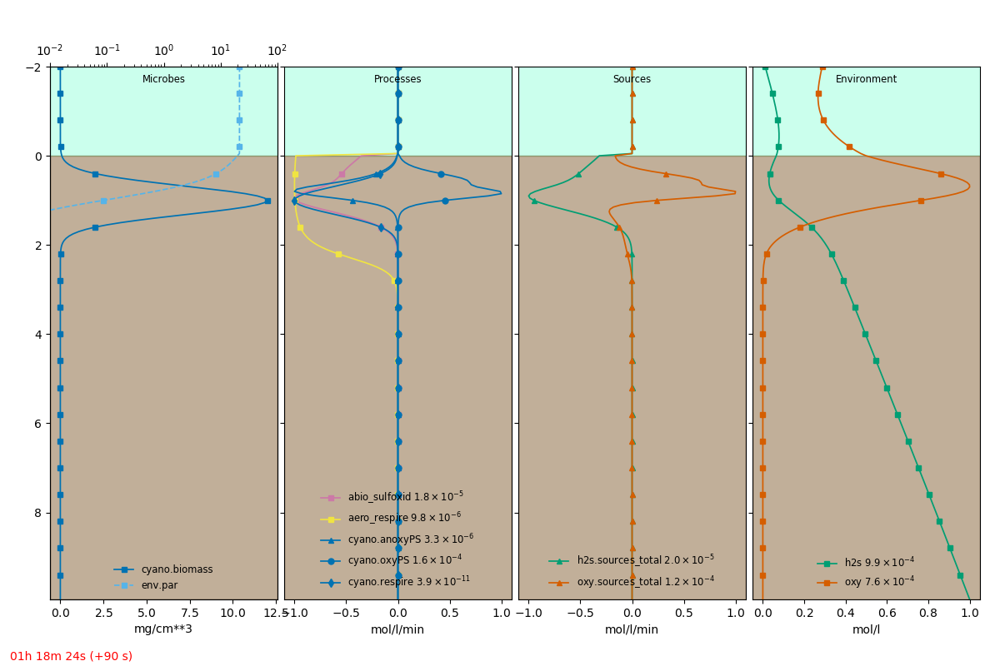

.. _tut03:

==================
Microbial groups
==================

In the previous tutorial :ref:`tut02`, we defined a microbenthic domain with two reacting
chemical solutes in the environment. We will now define specific microbial populations or groups
which perform specific metabolic processes involving the solutes. This tutorial derives
conceptually from de Wit et al (1995), but modifies it to focus on metabolic rates instead of
biomass growth. The formulations of the constitutive relationships between metabolisms and
environmental parameters are used from the paper, and the tutorial mainly indicates how these
symbolic relationships can be used to construct and solve coupled partial differential equations.

See the :download:`definition file <definition_input.yml>` for this tutorial.

.. seealso::
    Rutger de Wit, Frank P. van den Ende, Hans van Gemerden; Mathematical simulation of the
    interactions among cyanobacteria, purple sulfur bacteria and chemotrophic sulfur bacteria in
    microbial mat communities, FEMS Microbiology Ecology, Volume 17, Issue 2, 1 June 1995, Pages
    117–135 (`DOI <https://doi.org/10.1111/j.1574-6941.1995.tb00136.x>`_)

Cyanobacteria: biomass
=======================

We will define a distribution of cyanobacterial population in the microbenthic domain, which will
perform

* respiration
* oxygenic photosynthesis
* sulfide-driven anoxygenic photosynthesis

Microbial groups are defined under the ``microbes`` key under ``model``. Microbial groups contain
``features``, which represent variables related to the population, the primary one being biomass.
The definition of the ``cyano`` group could be specified as:

.. literalinclude:: definition_input.yml
    :language: yaml
    :lineno-match:
    :start-after: # start: microbes
    :end-before: # stop: microbes
    :emphasize-lines: 2,5,6,11-

We have specified a (typically required) feature called ``biomass`` that has the units of
:math:`kg/m^3`, and is seeded with a normal distribution centered at 1 mm depth with a width of 2
mm, reaching a maximum value of :math:`12 mg/cm^3`.

Light absorption
=================

Phototrophs, such as cyanobacteria, absorb light energy to use in their photosynthetic reactions.
The biomass-related depletion of the irradiance can be specified by modifying the irradiance
channel ``par`` as follows.

.. literalinclude:: definition_input.yml
    :language: yaml
    :lineno-match:
    :start-after: # start: channels
    :end-before: # stop: channels
    :emphasize-lines: 4,5

This specifies that an additional attenuation based on the biomass should occur in the
photosynthetically active radiation.

Oxygenic photosynthesis
=========================

Cyanobacteria perform oxygenic photosynthesis, i.e. they use the absorbed light energy to fix
carbon into their biomass and release dioxygen as a side product. For the current case, we ignore
any changes in biomass and consider the model dynamics for a short period of 4 hours. Oxygenic
photosynthesis produces oxygen, and the rate of this production would depend on the available
light and biomass at a specific depth in the microbial mat. So approximately, we consider the
oxygenic photosynthesis rate as :math:`Qmax \cdot biomass \cdot optimum(par, Ks, Ki)`, where the
``optimum`` function (unitless) describes the irradiance intensities which are optimal for the
biomass. However, it is known that oxygenic photosynthesis is inhibited by the presence of
sulfide and oxygen itself. These are represented through an ``inhibition`` function depending on a
particular variable. So the formulae we need are:

.. literalinclude:: definition_input.yml
    :language: yaml
    :lineno-match:
    :start-after: # start: formulae
    :end-before: # stop: formulae
    :emphasize-lines: 3,7,11

Using these in the ``model/formulae`` section, we can now define the oxygenic photosynthesis
process in the ``cyano`` group as:

.. literalinclude:: definition_input.yml
    :language: yaml
    :lineno-match:
    :start-after: # start: oxyPS1
    :end-before: # stop: oxyPS1
    :emphasize-lines: 3,7,15-20
    :dedent: 16

Note here that the ``biomass`` variable is sourced from the ``cyano`` microbial group, which
behaves as the domain. Variables not found in the group are then looked up from the group
containing the ``cyano`` group, that is the model. So the model domain is used to source the
``par`` and ``h2s`` variables.

This formulation is straightforward to write, but pops up a mathematical problem. The inhibition
function contains a :math:`x < Kmax` term, which makes the function only piecewise polynomial.
Piecewise functions cannot be generally considered differentiable. This affects the casting of
the process expression as an implicit source term (see `fipy docs`_ about implicit terms), since
it tries to estimate the first derivative of the function with respect to the variable. So here
we can simply turn off this behavior on a per-process level, by setting ``implicit: false`` in
the initialization parameters.

.. _fipy docs: https://www.ctcms.nist.gov/fipy/examples/phase/generated/examples.phase.simple.html

However, for complex non-linear source terms it is advantageous to be able to specify the pieces
of the piece-wise response in the equation terms. MicroBenthos allows you to therefore specify
the inhibition response of oxygen to the oxygen concentration itself by the formulation below.

.. literalinclude:: definition_input.yml
    :language: yaml
    :lineno-match:
    :start-after: # start: oxyPS2
    :end-before: # stop: oxyPS2
    :emphasize-lines: 6-
    :dedent: 16

In this formulation, we replaced the ``inhibition(oxy)`` term from before, and defined a
piecewise response of the process ourselves. The formulation of ``inhibition`` is taken as
before, but without the ``( x < Kmax )`` term, and is instead set as a piece mask in ``where``.
Now, we do not need to set ``implicit: false``, as each of the defined pieces in ``expr`` is
differentiable and MicroBenthos will handle the symbolic math accordingly to cast the overall
expression as an implicit source, if required.

Anoxygenic photosynthesis
===========================

Cyanobacteria also can use other electron donors than water, specifically, they can drive carbon
fixation through sulfide-driven photosynthesis. This process uses :math:`H_2S` instead of
:math:`H_2O`. We consider that this process is also driven by :math:`Qmax \cdot biomass \cdot
optimum(par, Ks, Ki)`, and further modulated by metabolic response functions. We consider that
the cyanobacterial population responds to the sulfide as an ``optimum`` function. So we write the
process for anoxygenic photosynthesis as follows.

.. literalinclude:: definition_input.yml
    :language: yaml
    :lineno-match:
    :start-after: # start: anoxyPS
    :end-before: # stop: anoxyPS
    :emphasize-lines: 6-7
    :dedent: 16

Respiration
=============

We can also include biomass-dependent respiration by the cyanobacteria itself. Similar to the
sedimentary aerobic respiration case, the process rate saturates with respect to oxygen.

.. literalinclude:: definition_input.yml
    :language: yaml
    :lineno-match:
    :start-after: # start: respire
    :end-before: # stop: respire
    :emphasize-lines: 5
    :dedent: 16

We note in all the cases above, that each process essentially provides a local "namespace" to
avoid clash of identically named parameters in other processes. Additionally, the microbial group
provides a local store of variables, like the model domain, and passes forward the look up for
missing variables to the model domain itself.

Run it
========

This creates the equations to solve

.. math::
    :nowrap:

    \begin{gather}

    \frac{d}{dt} oxy = Doxy \cdot \frac{d^{2}}{d z^{2}}  oxy + \frac{Qmax \cdot biomass \cdot
    oxy \cdot sed\_mask}{Km + oxy} \\
    - \frac{Vmax \cdot oxy \cdot porosity \cdot sed\_mask}{Km + oxy} \\
    + 2 \cdot h2s \cdot k \cdot oxy^{2} \cdot porosity \cdot sed\_mask \\
    + \frac{Qmax \cdot biomass \cdot par \cdot sed\_mask \cdot \left(Kmax - h2s\right) \cdot
    \left(Kmax_{2} - oxy\right)}
    {\left(1 + \frac{par}{Ki}\right) \cdot \left(Ks + par\right)
    \left(- Khalf + 2 Kmax - h2s\right) \left(- Khalf_{2} + 2 Kmax_{2} - oxy\right)} \\
    \cdot \left(h2s < Kmax\right)\cdot \left(oxy < Kmax_{2}\right)
    \end{gather}

    \begin{gather}
    \frac{d}{dt} h2s = Dh2s \cdot \frac{d^{2}}{d z^{2}}  h2s +  h2s \cdot k \cdot oxy^{2} \cdot
    porosity \cdot sed\_mask \\
    + \frac{Qmax \cdot biomass \cdot h2s \cdot par \cdot sed\_mask}{\left(1 + \frac{par}{Ki}\right)
    \cdot \left(1 + \frac{h2s}{Kih2s}\right) \left(Ks + par\right) \left(Ksh2s + h2s\right)}

    \end{gather}

Running the model simulation with::

    microbenthos -v simulate definition_input.yml --plot --show-eqns

should show the equation in the console and open up a graphical view of the model as it is
simulated.

An extracted frame is shown below.

The full :download:`definition file <definition_input.yml>` is:

.. literalinclude:: definition_input.yml
    :language: yaml
